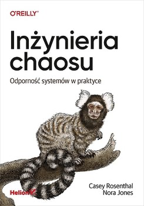

# Polecane materiały

Zapis polecanych informacji kanału Java na ZŻ - [Archiwum java](https://discord.com/channels/747549818938851384/749313399086645269) 
Poziom - mniej więcej Junior+

## Olinowe Polecanki

Informacje z wątku Olinowe Polecanki

- [Blog Technologiczny firmy Altkom](https://www.altkomsoftware.com/pl/blog/) 
  Przykładowy arykuł o testach 
  [Ile zaoszczędzisz, jeśli Twój Software House wprowadzi testy już na wczesnym etapie software developmentu?](https://www.altkomsoftware.com/pl/blog/ile-zaoszczedzisz-jesli-twoj-software-house-wprowadzi-testy-juz-na-wczesnym-etapie-software-developmentu/)

- Dobre źródło książek -
  https://libgen.is/
  Książki, które tutaj polecam to książki raczej na poziomie mida. Nie znajdziesz tu odpowiedzi jak stworzyć CRUDa w Springu, ale wymienione tu ksiązki to źródła wiedzy o ogólnie pojętych dobrych praktykach, architekturze i metodykach pracy.  
  Wszystkie wymienione tu książki są na libgen  
  📔 🇺🇸 Test Driven Development: By Example  
  🇵🇱 TDD. Sztuka tworzenia dobrego kodu  
  📔 🇺🇸 Clean Code: A Handbook of Agile Software Craftsmanship  
  🇵🇱 Czysty kod. Podręcznik dobrego programisty  
  📔 🇺🇸 Designing Data-Intensive Applications  
  📔 🇺🇸 The Clean Coder. A Code of Conduct for Professional Programmers  
  🇵🇱 Mistrz czystego kodu. Kodeks postępowania profesjonalnych programistów  
  📔 🇺🇸 Working Effectively with Legacy Code  
  🇵🇱 Praca z zastanym kodem. Najlepsze techniki  

- Artykuł o koncepcja Chaos Monkey  
  [Czym jest koncepcja Chaos Monkey opracowana przez Netflix](https://itwiz.pl/czym-jest-koncepcja-chaos-monkey-opracowana-przez/)

- Książka o inżynierii chaosu  
 
